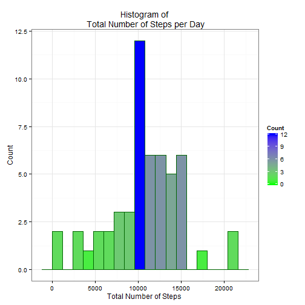
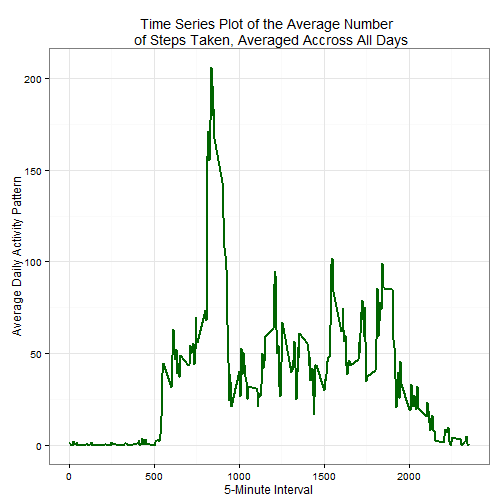
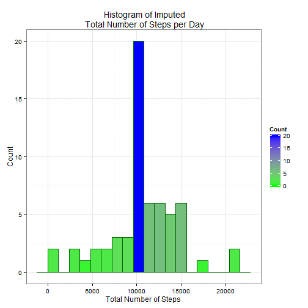
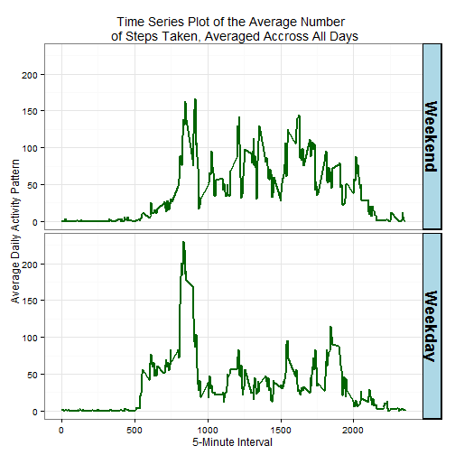

## Loading and preprocessing the data

Upload the data, capture the upload date and unzip the files. 


```r
if(!file.exists("./data")){dir.create("./data")} 

if(!file.exists("./data/activity.zip"))
{download.file("https://d396qusza40orc.cloudfront.net/repdata%2Fdata%2Factivity.zip", destfile="./data/activity.zip")}
date()
```

```
## [1] "Thu Nov 12 14:22:47 2015"
```

check if file is present and unzip  


```r
list.files("./data") 
```

```
## [1] "activity.csv" "activity.zip"
```

```r
if(length(list.files("./data"))==1)
{unzip("./data/activity.zip", exdir="./data")
 list.files("./data")}
```

1.  Load the data (i.e. read.csv())  
Check if file is already in the global environment
        
        ```r
        if(!(c("ACT") %in% ls())){
          ACT <- read.csv("./data/activity.csv", stringsAsFactors = FALSE)
          str(ACT)}
        ```

2.  Process / transform the data (if necessary) into a format suitable for your analysis

        
        ```r
        library(dplyr)
        library(ggplot2)
        ACT <- tbl_df(ACT)
        ACT <- ACT %>%
                mutate(wday = factor(
                        ifelse(
                                substr(
                                        weekdays(
                                                as.POSIXct(
                                                        strptime(date, "%Y-%m-%d")
                                                        )
                                                ),
                                        1,1)
                                =="S",
                                "Weekend", 
                                "Weekday"), 
                        levels = c("Weekend", "Weekday")))
        str(ACT)
        ```
        
        ```
        ## Classes 'tbl_df', 'tbl' and 'data.frame':	17568 obs. of  4 variables:
        ##  $ steps   : int  NA NA NA NA NA NA NA NA NA NA ...
        ##  $ date    : chr  "2012-10-01" "2012-10-01" "2012-10-01" "2012-10-01" ...
        ##  $ interval: int  0 5 10 15 20 25 30 35 40 45 ...
        ##  $ wday    : Factor w/ 2 levels "Weekend","Weekday": 2 2 2 2 2 2 2 2 2 2 ...
        ```


## What is mean total number of steps taken per day?
##### For this part of the assignment, you can ignore the missing values in the dataset.

1.  Calculate the total number of steps taken per day.  
Group data by date and summarize steps. I chose not to use na.rm in the sum function because it sets the missing values to zero which is not the same as ignoring them.

        
        ```r
        ACT.bydate <- ACT %>% group_by(date) %>% summarize(totalsteps = sum(steps))
        as.data.frame(ACT.bydate)
        ```
        
        ```
        ##          date totalsteps
        ## 1  2012-10-01         NA
        ## 2  2012-10-02        126
        ## 3  2012-10-03      11352
        ## 4  2012-10-04      12116
        ## 5  2012-10-05      13294
        ## 6  2012-10-06      15420
        ## 7  2012-10-07      11015
        ## 8  2012-10-08         NA
        ## 9  2012-10-09      12811
        ## 10 2012-10-10       9900
        ## 11 2012-10-11      10304
        ## 12 2012-10-12      17382
        ## 13 2012-10-13      12426
        ## 14 2012-10-14      15098
        ## 15 2012-10-15      10139
        ## 16 2012-10-16      15084
        ## 17 2012-10-17      13452
        ## 18 2012-10-18      10056
        ## 19 2012-10-19      11829
        ## 20 2012-10-20      10395
        ## 21 2012-10-21       8821
        ## 22 2012-10-22      13460
        ## 23 2012-10-23       8918
        ## 24 2012-10-24       8355
        ## 25 2012-10-25       2492
        ## 26 2012-10-26       6778
        ## 27 2012-10-27      10119
        ## 28 2012-10-28      11458
        ## 29 2012-10-29       5018
        ## 30 2012-10-30       9819
        ## 31 2012-10-31      15414
        ## 32 2012-11-01         NA
        ## 33 2012-11-02      10600
        ## 34 2012-11-03      10571
        ## 35 2012-11-04         NA
        ## 36 2012-11-05      10439
        ## 37 2012-11-06       8334
        ## 38 2012-11-07      12883
        ## 39 2012-11-08       3219
        ## 40 2012-11-09         NA
        ## 41 2012-11-10         NA
        ## 42 2012-11-11      12608
        ## 43 2012-11-12      10765
        ## 44 2012-11-13       7336
        ## 45 2012-11-14         NA
        ## 46 2012-11-15         41
        ## 47 2012-11-16       5441
        ## 48 2012-11-17      14339
        ## 49 2012-11-18      15110
        ## 50 2012-11-19       8841
        ## 51 2012-11-20       4472
        ## 52 2012-11-21      12787
        ## 53 2012-11-22      20427
        ## 54 2012-11-23      21194
        ## 55 2012-11-24      14478
        ## 56 2012-11-25      11834
        ## 57 2012-11-26      11162
        ## 58 2012-11-27      13646
        ## 59 2012-11-28      10183
        ## 60 2012-11-29       7047
        ## 61 2012-11-30         NA
        ```

2.  Make a histogram of the total number of steps taken each day

        
        ```r
        ggp <- ggplot(ACT.bydate, aes(x=totalsteps))
        ggp + geom_histogram(binwidth = 1200, colour = "darkgreen", aes(fill = ..count..)) +
                scale_fill_gradient("Count", low = "green", high = "blue") + 
                theme_bw() + 
                xlab("Total Number of Steps") +
                ylab("Count") +
                ggtitle("Histogram of\n Total Number of Steps per Day")
        ```
        
         

3.  Calculate and report the mean and median of the total number of steps taken per day
        
        ```r
        total.steps.per.day <- rbind(mean(ACT.bydate$totalsteps, na.rm = TRUE),
                                     median(ACT.bydate$totalsteps, na.rm = TRUE))
        row.names(total.steps.per.day) <- c("Mean", "Median")
        colnames(total.steps.per.day) <- "Total Steps Per Day"
        total.steps.per.day
        ```
        
        ```
        ##        Total Steps Per Day
        ## Mean              10766.19
        ## Median            10765.00
        ```


## What is the average daily activity pattern?

1.  Make a time series plot of the 5-minute interval (x-axis) and the average number of steps taken, averaged across all days (y-axis)  
REFERENCE   
http://stackoverflow.com/questions/12196539/ggplot-change-line-width  
Group data by interval, summarize average steps, and plot

        
        ```r
        ACT.byinterval <- ACT %>% 
                group_by(interval) %>% 
                summarize(activity.pattern = mean(steps, na.rm = TRUE))
        ggp <- ggplot(ACT.byinterval, aes(x=interval, y = activity.pattern))
        ggp + geom_line(aes(size=1), colour = "darkgreen") +
                theme_bw() +
                scale_size(range = c(.10, 1.5), guide = FALSE) +
                xlab("5-Minute Interval") +
                ylab("Average Daily Activity Pattern") +
                ggtitle("Time Series Plot of the Average Number\n of Steps Taken, Averaged Accross All Days")
        ```
        
         

2.  Which 5-minute interval, on average across all the days in the dataset, contains the maximum number of steps?

        
        ```r
        as.data.frame(ACT.byinterval[ACT.byinterval$activity.pattern==
                                             max(ACT.byinterval$activity.pattern, na.rm=TRUE),1])
        ```
        
        ```
        ##   interval
        ## 1      835
        ```


## Imputing missing values
Note there are a number of days/intervals where there are missing values(coded as "NA"). The presence of missing days may introduce bias into some calculations or summaries of the data.

1.  Calculate and report the total number of missing values in the dataset (i.e. the total number of rows with NA's)
        
        ```r
        sum(is.na(ACT))
        ```
        
        ```
        ## [1] 2304
        ```

2.  Devise a strategy for filling in all of the missing values in the dataset. The strategy does not need to be sophisticated. For example you could use the mean/median for that day or the mean for that 5 minute interval.  
Here I have chosen to calculate the mean for the 5 minute interval and replace NA's with the mean.  
Reference:  
http://stackoverflow.com/questions/21714867/replace-na-in-a-dplyr-chain  
http://stackoverflow.com/questions/21841146/is-there-an-r-dplyr-method-for-merge-with-all-true    
        
        ```r
        ACT.interval <- ACT %>% 
                group_by(interval) %>% 
                        summarize(mean.act = mean(steps, na.rm = TRUE))
        ```

3.  Create a new dataset that is equal to the original dataset but with the missing data filled in

        
        ```r
        ACT
        ```
        
        ```
        ## Source: local data frame [17,568 x 4]
        ## 
        ##    steps       date interval    wday
        ##    (int)      (chr)    (int)  (fctr)
        ## 1     NA 2012-10-01        0 Weekday
        ## 2     NA 2012-10-01        5 Weekday
        ## 3     NA 2012-10-01       10 Weekday
        ## 4     NA 2012-10-01       15 Weekday
        ## 5     NA 2012-10-01       20 Weekday
        ## 6     NA 2012-10-01       25 Weekday
        ## 7     NA 2012-10-01       30 Weekday
        ## 8     NA 2012-10-01       35 Weekday
        ## 9     NA 2012-10-01       40 Weekday
        ## 10    NA 2012-10-01       45 Weekday
        ## ..   ...        ...      ...     ...
        ```
        
        ```r
        ACT2 <- full_join(ACT, ACT.interval) %>%
               mutate(steps = ifelse(is.na(steps), mean.act, steps)) %>%
               select(-mean.act)
        ```
        
        ```
        ## Joining by: "interval"
        ```
        
        ```r
        ACT2
        ```
        
        ```
        ## Source: local data frame [17,568 x 4]
        ## 
        ##        steps       date interval    wday
        ##        (dbl)      (chr)    (int)  (fctr)
        ## 1  1.7169811 2012-10-01        0 Weekday
        ## 2  0.3396226 2012-10-01        5 Weekday
        ## 3  0.1320755 2012-10-01       10 Weekday
        ## 4  0.1509434 2012-10-01       15 Weekday
        ## 5  0.0754717 2012-10-01       20 Weekday
        ## 6  2.0943396 2012-10-01       25 Weekday
        ## 7  0.5283019 2012-10-01       30 Weekday
        ## 8  0.8679245 2012-10-01       35 Weekday
        ## 9  0.0000000 2012-10-01       40 Weekday
        ## 10 1.4716981 2012-10-01       45 Weekday
        ## ..       ...        ...      ...     ...
        ```
 
4.  Make a histogram of the total number of steps taken each day. 

        
        ```r
        ACT2.bydate <- ACT2 %>% group_by(date) %>% summarize(totalsteps = sum(steps))
        
        ggp <- ggplot(ACT2.bydate, aes(x=totalsteps))
        ggp + geom_histogram(binwidth = 1200, colour = "darkgreen", aes(fill = ..count..)) +
                scale_fill_gradient("Count", low = "green", high = "blue") + 
                theme_bw() + 
                xlab("Total Number of Steps") +
                ylab("Count") +
                ggtitle(" Histogram of Imputed\n Total Number of Steps per Day")
        ```
        
         

- Calculate and report the **mean** and **median** total number of steps taken per day. 

```r
total.steps.per.day2 <- rbind(mean(ACT2.bydate$totalsteps),
                             median(ACT2.bydate$totalsteps))
row.names(total.steps.per.day2) <- c("Mean", "Median")
colnames(total.steps.per.day2) <- "Total Steps Per Day"
total.steps.per.day2
```

```
##        Total Steps Per Day
## Mean              10766.19
## Median            10766.19
```
-  Do these values differ from the estimates from the first part of the assignment?  

```r
print("Yes, the Median differs")
```

```
## [1] "Yes, the Median differs"
```
-  What is the impact of imputing missing data on the estimates of the total daily number of steps?

```r
print("Imputing the missing data by replacing missings with the mean causes the Median to approach the Mean, and in the case of this data, the Median equals the Mean")
```

```
## [1] "Imputing the missing data by replacing missings with the mean causes the Median to approach the Mean, and in the case of this data, the Median equals the Mean"
```


## Are there differences in activity patterns between weekdays and weekends?
Use the dataset with the filled-in missing values for this part.   

1.  Create a new factor variable in the dataset with two levels "weekday" and "weekend" indicating whether a given date is a weekday or a weekend day.

        
        ```r
        str(ACT2)
        ```
        
        ```
        ## Classes 'tbl_df', 'tbl' and 'data.frame':	17568 obs. of  4 variables:
        ##  $ steps   : num  1.717 0.3396 0.1321 0.1509 0.0755 ...
        ##  $ date    : chr  "2012-10-01" "2012-10-01" "2012-10-01" "2012-10-01" ...
        ##  $ interval: int  0 5 10 15 20 25 30 35 40 45 ...
        ##  $ wday    : Factor w/ 2 levels "Weekend","Weekday": 2 2 2 2 2 2 2 2 2 2 ...
        ```

2.  Make a panel plot containing a time series plot of the 5-minute interval (x-axis) and the average number of steps taken, averaged across all weekday days or weekend days (y-axis).


```r
ACT2.interval <- ACT2 %>% 
        group_by(interval, wday) %>% 
                summarize(mean.act = mean(steps))

ggp <- ggplot(ACT2.interval, aes(x = interval, y = mean.act, group = wday))
ggp + facet_grid(wday~.) + 
        geom_line(lwd = 1, colour = "darkgreen") + 
        theme_bw() + 
        theme(strip.text = element_text(face="bold", size=rel(1.5)), 
              strip.background = element_rect(fill="lightblue", colour = "black", size = 1)) + 
        labs(x="5-Minute Interval", 
         y="Average Daily Activity Pattern",
         title = " Time Series Plot of the Average Number\n of Steps Taken, Averaged Accross All Days")
```

 
